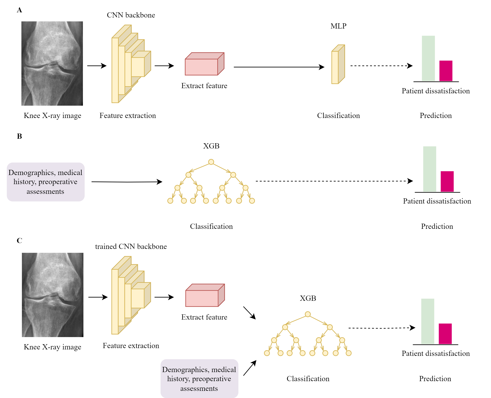

# Identifying who are unlikely to benefit from total knee arthroplasty: a machine learning approach

This repository contains the code that we used to train and explain the models for total knee arthroplasty outcome prediction. 
The paper is published in *npj Digital Medicine* 7. The published paper can be found at https://www.nature.com/articles/s41746-024-01265-8. 

[Xiaodi Liu](https://github.com/dillys10) also contributes to the development of the code. 


## Overview 
Identifying and preventing patients who are not likely to benefit long-term from total knee arthroplasty (TKA) would decrease healthcare expenditure significantly. We trained machine learning models among 5,720 knee OA patients to predict postoperative dissatisfaction at 2 years. 
 
<!-- Dissatisfaction was defined as not achieving a minimal clinically important difference in postoperative Knee Society knee and function scores (KSS), Short Form-36 Health Survey [SF-36, divided into a physical component score (PCS) and mental component score (MCS)], and Oxford Knee Score (OKS).  -->


<p align="center">
    
    <br>
    Overview of the proposed machine learning models: A. image-only model. B. clinical-data only model. C. multimodal model.
    <br>
    CNN=convolutional neural network, MLP=multilayer perceptron, XGB= Extreme Gradient Boosting
</p>


Compared to image-only models, both clinical-data only and multimodal models achieved superior performance at predicting dissatisfaction measured by AUC. Our findings highlighted that ML models using clinical or multimodal data were capable to predict post-TKA dissatisfaction. 

<!-- | Outcomes                   | Clinical-only model | Multimodal model    | Image-only model    |
| -------------------------- | ------------------- | ------------------- | ------------------- |
| Not achieve KSS MCID       | 0.888 (0.866-0.909) | 0.891 (0.870-0.911) | 0.577 (0.540–0.612) |
| Not achieve SF-36 PCS MCID | 0.836 (0.812-0.860) | 0.832 (0.808-0.857) | 0.542 (0.510-0.574) |
| Not achieve SF-36 MCS MCID | 0.833 (0.812-0.854) | 0.835 (0.811-0.856) | 0.486 (0.455-0.519) |
| Not achieve OKS MCID       | 0.806 (0.753-0.859) | 0.816 (0.768-0.863) | 0.617 (0.557-0.677) |  -->

## Implementation 
The software we used in the development and their versions can be found in `requirements.txt`.

Dataset was constructed using `dataset.py`. Model architecture can be found in `knee_net.py`.

To train and evaluate the machine learning models, we used the following scripts
- image-only model: `train_image_clinical_nn.py` 
- clinical-only model: `train_clinical_data.py` 
- multimodal model: `train_multimodal_xgb.py`

To explain learned model, we use `shapley_value.py` and `gradcam.py`.


## Citation 
If you find our paper useful, please cite it as
```
```